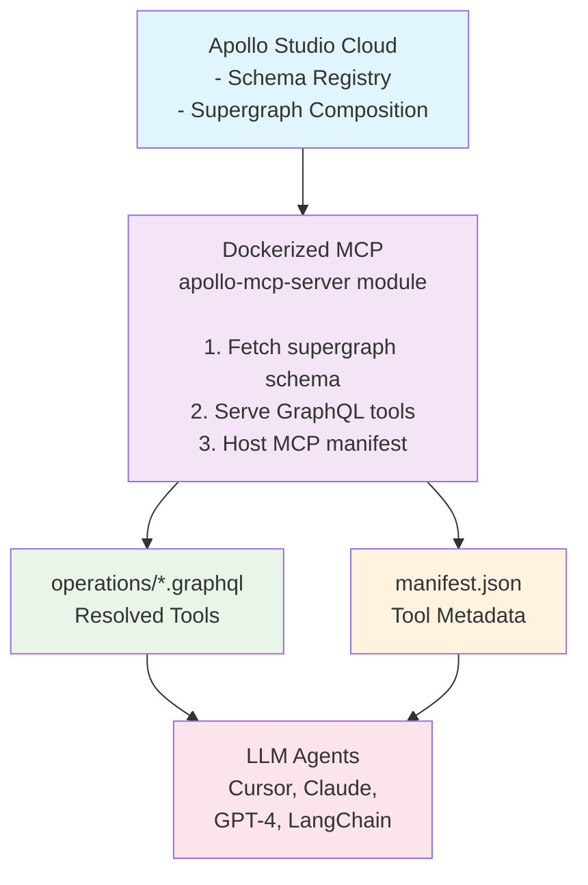

# 🧱 Architecture: Marriott GraphQL MCP Server

A modular, federated, containerized framework to expose Marriott’s internal GraphQL platform as discoverable tools for LLMs using Apollo’s Model Context Protocol (MCP).

---

## 🚀 Project Goals

- Serve Marriott GraphQL capabilities as AI-accessible tools
- Interface cleanly with LLM platforms (e.g. Cursor, Claude, OpenAI)
- Leverage Apollo’s MCP spec for semantic metadata + structured invocation
- Support dynamic schema fetching (Apollo Studio) & local dev schema loading
- Scale easily across environments using Docker + `.env`
- Provide CI/CD, observability, and multi-agent readiness

---

## 🧠 Key Concepts

### 🧩 Model Context Protocol (MCP)
> Apollo MCP allows LLMs to **discover**, **understand**, and **invoke** tools through standard GraphQL operations.

- Each tool = 1 operation + semantic metadata (name, description, usage)
- Tools are published via:

```plaintext
/.well-known/apollo-mcp/manifest.json
```

---

## 🧱 High-Level Architecture



---

## 🌐 Schema Integration

### Option A: Remote (Apollo Studio)

```bash
rover supergraph fetch $APOLLO_GRAPH_REF --api-key $APOLLO_KEY > supergraph.graphql
```

- Set via `.env`:
```env
APOLLO_KEY=your-apollo-api-key
APOLLO_GRAPH_REF=marriott-supergraph@current
SCHEMA_SOURCE=remote
```

### Option B: Local Schema

```env
SCHEMA_SOURCE=local
```
Schema loaded from `schema.graphql`.

---

## 🔐 Environment Variables

| Variable | Description |
|----------|-------------|
| `APOLLO_KEY` | Apollo Studio API Key |
| `APOLLO_GRAPH_REF` | Graph ref (e.g. `mygraph@current`) |
| `SCHEMA_SOURCE` | `remote` or `local` |

---

## 🐳 Docker Structure

- `Dockerfile`: Container for MCP server
- `docker-compose.yml`: Spins up server + optional mock Postgres (e.g. Neon)
- Volumes: `/operations`, `/schema.graphql`, `/manifest.json`

---

## 🚧 CI/CD & Monitoring

- GitHub Actions pipeline:
  - Lint + build + push Docker image
  - Optional deploy hook to re-fetch schema
- Prometheus-compatible metrics enabled via Apollo tracing

---

## 📈 Future Enhancements

- More tools: `cancelReservation`, `loyaltyLookup`, etc.
- Auto-sync schemas nightly
- Per-deployment manifest validation
- Auth middleware for sensitive tools

---

_Made with ❤️ by a full-stack architect on a mission to merge GraphQL + AI interoperability._

